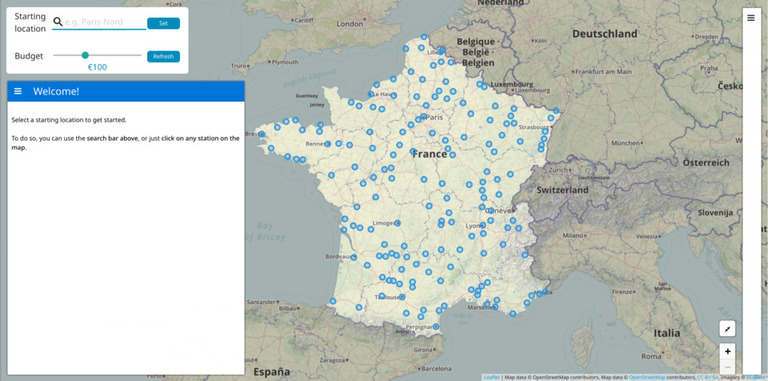
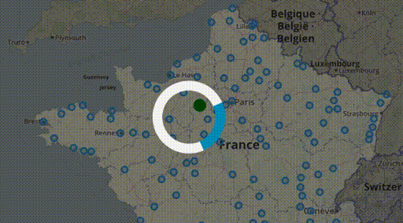
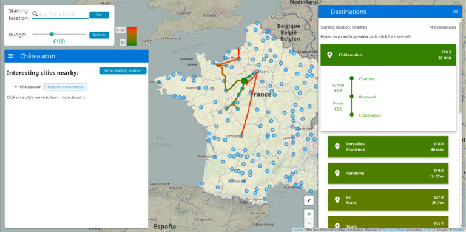

Interactive Trip Planner
========================

Introduction
------------

Is traveling and discovering new places and people your passion?  
Do you want to feed that passion without burning through your pocket?

As a group of students, this is the situation we found ourselves in: eager to
go on trips, but with the need to balance our trips and spending.

With that in mind, we built this application that lets you visualize and easily
decide which city to visit in France, based on the budget you want.

Usage
-----



On the map, you can see all the stops near important cities as blue markers. If
you zoom in, you can also see other, less important stops. Important cities are
simply historic cities (cities with historical monuments) or cities that are
classified by France as [Villes d'Art et
d'Histoire](https://fr.wikipedia.org/wiki/Villes_et_Pays_d'art_et_d'histoire)

You can select your budget for the trip by using the scroller on the top left
corner and the starting station by filling the text box right above it. You can
also select a starting station from the map, by clicking on a city's marker
then pressing the "Set as starting location" button.


By selecting the starting station, you should see all the possible routes you
can take with the chosen budget. The colors used for the edges reflect the
price of the trip to a linked station. The closer the color to red, the closer
it is to your limit budget. Similarily, the closer it is to green the cheaper
the trip price is. Note that you can always check the legend next to the
scroller.



Clicking on a stop will show some additional information on a sidebar to the
left, such as interesting cities that can be accessed once you're at selected
stop.

There, you can click on a nearby city's name in that list to show a short
summary about the city, as well as a list of monuments you can visit there.


An alternate view is also offered to view detailed routes info: the right
sidebar will show you a sorted list, and you can expand a specific route you're
interested in to view the exact stops and durations/price breakdown.
Additionally, hovering your mouse on one of the items will preview that path on
the map (and in reverse, clicking on a path on the map will open that item's
details view in the right sidebar).




Data viz notes
--------------

We unfortunately couldn't resolve some issues with the datasets we're using
(obtained from [SNCF](https://data.sncf.com/explore/)).  
This is mostly due to (1) incomplete or outdated data offered by SNCF; (2)
severe inconsistencies between the data sources.  
We also had to use the full prices for the tickets, as that was the only
consistent data point we could access. You might notice that your favorite
metro stop is missing, or that some routing paths are not present when they
should be.  
We did our best to fix as many of these issues as possible, and hope you'll
enjoy interacting with our tool. (In case we find more consistent data sources,
we'd also love to adapt our tool to use these instead.)

-------------------------------------------------------------------------------

Files
------

For details, please refer to the process book (`process_book.pdf`)).

- `preprocessing/` directory: contains the notebooks we used for
  pre-processing.
- `preprocessing/data` directory: the pre-processed data used by our server.
- `web/client` directory: contains the web client (blog-style short article +
  data viz).
- `web/server` directory: the server component of our data viz.

Running the webpage / server
----------------------------

Our data viz has two components, a client and a server. Running the server is
done by using Flask from the `web/server` directory:
```bash
$ cd web/server/
$ FLASK_APP=main.py flask run
```

Once the server is running, you can simply open `index.html` from the
`web/client` directory.

Dependencies
------------

Server dependencies:

- [networkx](https://pypi.org/project/networkx/)
- [pandas](https://pypi.org/project/pandas/)
- [flask](https://pypi.org/project/Flask/)

Libraries/templates used for the client:

- [Bootstrap](https://getbootstrap.com/) with [Clean Blog template](https://github.com/BlackrockDigital/startbootstrap-clean-blog)
- [Leaflet](https://leafletjs.com/)
- [sidebar-v2](https://github.com/Turbo87/sidebar-v2)
- [Leaflet-snogylop](https://github.com/ebrelsford/Leaflet.snogylop)
- [materializecss](https://materializecss.com/)
- [Leaflet.EasyButton](https://github.com/CliffCloud/Leaflet.EasyButton/)
- [Leaflet.Polyline.SnakeAnim](https://github.com/IvanSanchez/Leaflet.Polyline.SnakeAnim/)
- [Wikipedia.JS](http://okfnlabs.org/wikipediajs/)
- [Chroma.js](https://github.com/gka/chroma.js)
- [jQuery](https://jquery.com/)

Pre-processing dependencies (depends on the specific notebook):

- [pandas](https://pypi.org/project/pandas/)
- [numpy](https://pypi.org/project/numpy/)
- [networkx](https://pypi.org/project/networkx/)
- [swifter](https://pypi.org/project/swifter/)
- [folium](https://pypi.org/project/folium/)
